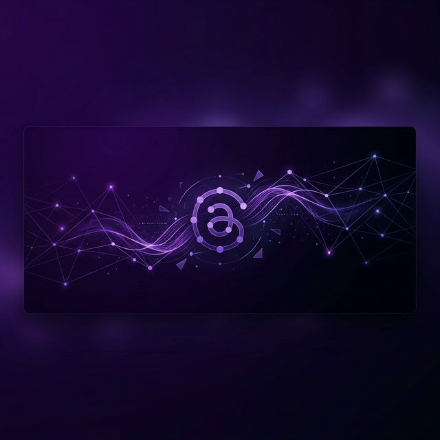

# 🧵 Threads Clone



A full-stack Threads clone built with **Next.js 14**, **TypeScript**, **MongoDB**, and **Clerk**. This application replicates the core functionality of Meta's Threads, providing a seamless experience for creating, sharing, and interacting with short-form content.

## 🚀 Features

-   **Authentication & Onboarding**: Secure user authentication via Clerk with a custom onboarding flow to set up user profiles.
-   **Thread Management**:
    -   Create, delete, and view threads.
    -   Comment on threads with nested reply support.
-   **Communities**:
    -   Create and manage communities.
    -   Invite members and assign roles.
    -   Community-specific thread feeds.
-   **User Profiles**: Customizable user profiles showcasing user activity, threads, and replies.
-   **Search & Discovery**: Robust search functionality for finding users and communities.
-   **Activity Feed**: Get notified of interactions like replies and new followers.
-   **Responsive Design**: Fully responsive UI built with Tailwind CSS, optimized for mobile and desktop.
-   **File Storage**: Seamless image uploads using UploadThing.

## 🛠️ Tech Stack

-   **Framework**: [Next.js 14 (App Router)](https://nextjs.org/)
-   **Language**: [TypeScript](https://www.typescriptlang.org/)
-   **Auth**: [Clerk](https://clerk.com/)
-   **Database**: [MongoDB](https://www.mongodb.com/) with [Mongoose](https://mongoosejs.com/)
-   **Styling**: [Tailwind CSS](https://tailwindcss.com/)
-   **Components**: [Radix UI](https://www.radix-ui.com/) & [Shadcn UI](https://ui.shadcn.com/)
-   **Forms**: [React Hook Form](https://react-hook-form.com/) & [Zod](https://zod.dev/)
-   **File Uploads**: [UploadThing](https://uploadthing.com/)

## 🏁 Getting Started

### Prerequisites

-   Node.js 18.17 or later
-   MongoDB Atlas account
-   Clerk account
-   UploadThing account

### Installation

1.  **Clone the repository**:
    ```bash
    git clone https://github.com/your-username/threads_clone.git
    cd threads_clone
    ```

2.  **Install dependencies**:
    ```bash
    npm install
    ```

3.  **Set up environment variables**:
    Create a `.env.local` file in the root directory and add the following variables (refer to `.env.example`):
    ```env
    NEXT_PUBLIC_CLERK_PUBLISHABLE_KEY=
    CLERK_SECRET_KEY=
    NEXT_PUBLIC_CLERK_SIGN_IN_URL=/sign-in
    NEXT_PUBLIC_CLERK_SIGN_UP_URL=/sign-up
    NEXT_PUBLIC_CLERK_AFTER_SIGN_IN_URL=/onboarding
    NEXT_PUBLIC_CLERK_AFTER_SIGN_UP_URL=/onboarding

    MONGODB_URL=

    UPLOADTHING_SECRET=
    UPLOADTHING_APP_ID=
    ```

4.  **Run the development server**:
    ```bash
    npm run dev
    ```

Open [http://localhost:3000](http://localhost:3000) with your browser to see the result.

## 📁 Project Structure

```text
├── app/                  # Next.js App Router (pages & layouts)
│   ├── (auth)/           # Authentication routes
│   ├── (root)/           # Main application routes
│   └── api/              # API routes & webhooks
├── components/           # React components
│   ├── cards/            # Thread and User cards
│   ├── forms/            # Form components (Zod + Hook Form)
│   ├── shared/           # Sidebar, Navbars, etc.
│   └── ui/               # Base UI components
├── lib/                  # Backend logic & utilities
│   ├── actions/          # Server Actions (database operations)
│   ├── models/           # Mongoose models
│   └── validations/      # Zod validation schemas
├── public/               # Static assets
└── constants/            # Application constants
```

## 📜 License

This project is licensed under the MIT License.
